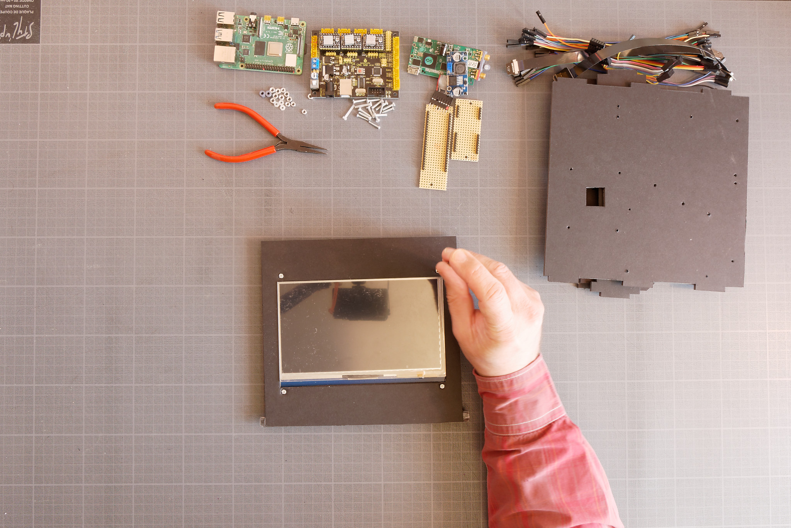
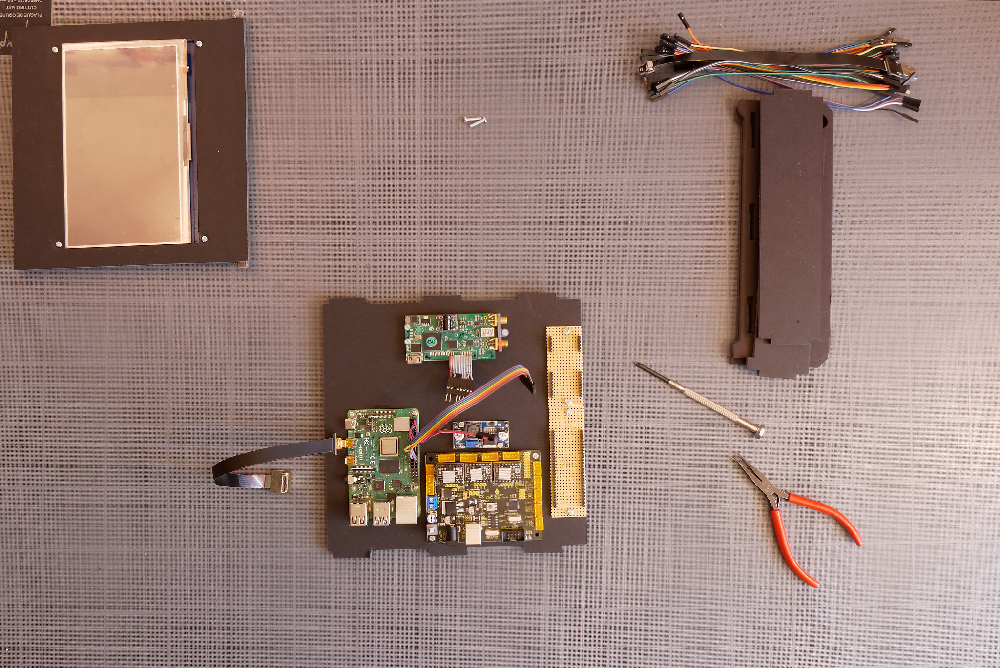
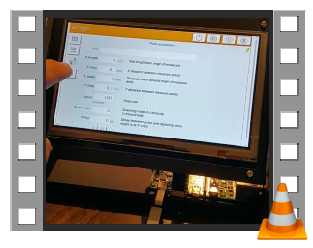

# echolab_box

## Introduction

| Prerequisite                     | None            |
| :------------------------------- | --------------- |
| **Duration**                     | 1/2 day         |
| **Cost**                         | 800 - 900 €     |
| **Open-source License Software** | BSD3 License    |
| **Open-source License Hardware** | EchOpen License |

echolab_box is the first step of the echolab project by echOpen. The idea of echolab (EchOpen Lab Kit) project is to capitalize on all the previous contribution of the community and design an open-source modular hardware  "EchOpen Lab Kit" which enable everyone to make their own acoustic, software and firmware experiment. We want to develop a full range of components compatible and combinable with one another in order to build a custom lab. echolab_box is the core module conceived as a test bench on which you can plug devices such as 2D table, custom ultrasound card, custom transducers...

## Design files

The only design files needed to build echolab_scope are the casing files as all the other component are mechanic or electronic parts available on the market.

| Title  | Original files                                | Reading files                                              | Design tool                                    |
| ------ | --------------------------------------------- | ---------------------------------------------------------- | ---------------------------------------------- |
| Casing | [Link to originals](../meca/echolab_box_v3.fcstd) | [Link to reading files](../meca/build/casing_to_print.pdf) | [FreeCad](https://www.freecadweb.org/?lang=fr) |

*Original files: files used to make modifications on the project*

*Export files: files that can be opened and imported by other programs or softwares (STEP, IGES...)*

*Reading files: files used to study or produce without modifications (PDF, STL...)*

## Software and firmware

| Source code                     | Compilation process | State       |
| ------------------------------- | ------------------- | ----------- |
| [echolab_box/soft/src](../soft/src) | Python 3            | In progress |

## Nomenclature

| Designation          | Quantity | Description                                                  | Supplier  | Price/unit (€ TTC) | Datasheet                                                    |
| -------------------- | -------- | ------------------------------------------------------------ | --------- | ------------------ | ------------------------------------------------------------ |
| Software Controller  | 1        | Controller Rpi - 4GB                                         | LetMeKnow | 69                 | [Link to datasheet]([https://letmeknow,fr/shop/fr/cartes-officielles/1782-raspberry-pi-4-4gb-4053199971756,html](https://letmeknow.fr/shop/fr/cartes-officielles/1782-raspberry-pi-4-4gb-4053199971756.html)) |
| Touch screen         | 1        | Screen waveshark 7 inch Capacitive Touch Screen HDMI LCD 1024 * 600 | Amazon    | 60,96              | [Link to datasheet](https://www.amazon.fr/waveshare-Capacitive-Touchscreen-Display-LCD/dp/B07PK26D9H/ref=sr_1_6?__mk_fr_FR=ÅMÅŽÕÑ&keywords=screen%2B7%2Bhdmi&qid=1568879840&s=gateway&sr=8-6&th=1) |
| Ultrasound card      | 1        | Ultrasound card open-source                                  | echOpen   | 600                |                                                              |
| CNC card             | 1        | CNC card KEYESTUDIO Grbl Blister CNC carte contrôleur DIY    | Amazon    | 21,59              | [Link to datasheet](https://www.amazon.fr/keyestudio-contrôleur-Microcontrôleur-automatique-Fantasque/dp/B07D8LN386/ref=sr_1_17?__mk_fr_FR=ÅMÅŽÕÑ&keywords=cnc+shield&qid=1568881247&s=gateway&sr=8-17) |
| 5V Down power supply | 2        | 5V regulator DFR0571 3 A maxi                                | GoTronic  | 3,7                | [Link to datasheet](https://www.gotronic.fr/art-regulateur-5-vcc-dfr0571-29558.htm) |
| 12V Power supply     | 1        | 12V Power supply                                             |           |                    |                                                              |
| Connections          | 1        | HDMI display                                                 | Adafruit  | 5,88               | https://www,adafruit,com/product/3549                        |
| Connections          | 1        | HDMI RPi                                                     | Adafruit  | 5,88               | https://www,adafruit,com/product/3557                        |
| Connections          | 2        | Wire 20 cm                                                   | Adafruit  | 1,76               | https://www,adafruit,com/product/3561                        |
| Connections          | 2        | µUSB display and RPi                                         | Adafruit  | 4,48               | https://www,adafruit,com/product/4105                        |
| Connections          |          | PCB connector                                                |           |                    |                                                              |
| Casing               |          | Casing                                                       |           |                    |                                                              |
| Fasteners            |          | Fasteners                                                    |           |                    |                                                              |

## Assembly

| List of tools needed | Where to find it? |
| -------------------- | ----------------- |
| Screw driver         | *(Optional)*      |
| In Progress...       |                   |

| Picture                                      | Assembly instructions                 |
| -------------------------------------------- | ------------------------------------- |
|  | Hardware components  We are using M2.5x12 screws and M2.5 nuts for all the assembly |
|  | Mount the touch screen on the top part of the box |
|  | Mount the Raspberry Pi controller on the base of the casing |
|  | Mount the CNC card        |
|  | Mount the 5V Step down power supply |
|  | Mount the ultrasound card. This model is a US SPI (can be replaced by another open-source model) |
|  | Mount the connector board |
|  | Connect the HDMI wire to the Raspberry Pi |
|  | We are now going to connect all the components following this wiring scheme |
|  | Connect the RPi to the ultrasound board                      |
|  | Then connect the CNC card to the 5V Step down power supply |
|  | Connect the 12V Power supply to the CNC card |
|  | Set the Step down power supply to 5V prior to connect the RPi |
|  | Connect stepper wires from CNC card to connector board |
|  | Mount the casing parts and the touch screen |
|  | Connect the screen and the RPi |

## Use

  

This video is showing a previous version of echolab_box

*Starting guide and operating instructions in progress ...*

